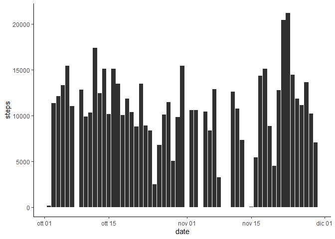
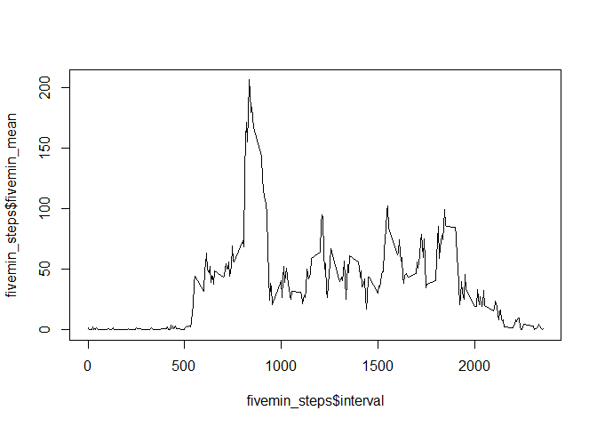
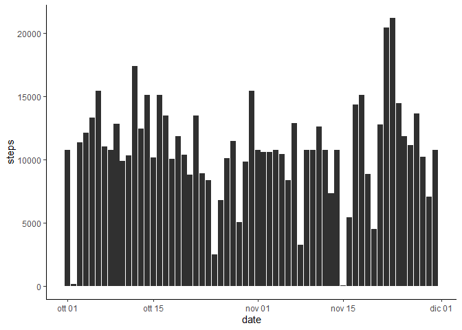
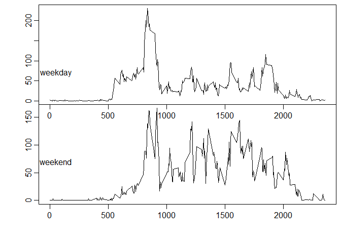

1. Load the data 

```r
activity <- read_csv("activity.zip")
```
2. Process/transform the data (if necessary) into a format suitable for your analysis

```r
activity <- activity %>% mutate(date = as.Date(date))
```

3. Calculate the total number of steps taken per day

```r
d_steps  <- activity %>% group_by(date) %>% summarise(daily_steps = sum(steps)) #%>% filter(is.na(daily_steps) == FALSE)
```

4. Make a histogram of the total number of steps taken each day

```r
ggplot(activity, aes(date, steps)) + 
      geom_bar(stat = 'identity', fill = colors()[280]) + 
      theme_classic()
```

<!-- -->

5. Calculate and report the mean and median of the total number of steps taken per day

```r
mean   <- as.integer(mean(d_steps$daily_steps, na.rm = TRUE))
median <- as.integer(median(d_steps$daily_steps, na.rm = TRUE))
```

Mean of the total number of steps taken per day: 10766

Median of the total number of steps taken per day: 10765

6. Make a time series plot of the 5-minute interval (x-axis) and the average number of steps taken, averaged across all days (y-axis)

```r
fivemin_steps <- activity %>% group_by(interval) %>% summarise(fivemin_mean = mean(steps, na.rm = TRUE)) 
plot(fivemin_steps$interval, fivemin_steps$fivemin_mean, type = "l")
```

<!-- -->

7. Which 5-minute interval, on average across all the days in the dataset, contains the maximum number of steps?

```r
max_fivemin_interval <- fivemin_steps %>% filter(fivemin_mean == max(fivemin_steps$fivemin_mean))
```
5-minute interval, on average across all the days in the dataset, that contains the maximum number of steps: 835  

8. Calculate and report the total number of missing values in the dataset (i.e. the total number of rows with \color{red}{\verb|NA|}NAs)

```r
n_NAs  <- activity %>% filter(is.na(steps) == TRUE)
nrow(n_NAs)
```

```
## [1] 2304
```

9. Devise a strategy for filling in all of the missing values in the dataset. The strategy does not need to be sophisticated. For example, you could use the mean/median for that day, or the mean for that 5-minute interval, etc.

__I'll use the mean for each 5-minute interval__

10. Create a new dataset that is equal to the original dataset but with the missing data filled in.

```r
activity_a <- activity %>% filter(is.na(steps) == TRUE)
activity_b <- activity %>% filter(is.na(steps) == FALSE)
activity_a <- left_join(activity_a, fivemin_steps)
activity_a <- activity_a %>% select(fivemin_mean, date, interval) %>% rename(steps = fivemin_mean)
activity_filled <- rbind(activity_b, activity_a)
```

11. Make a histogram of the total number of steps taken each day and Calculate and report the mean and median total number of steps taken per day. Do these values differ from the estimates from the first part of the assignment? What is the impact of imputing missing data on the estimates of the total daily number of steps?

```r
ggplot(activity_filled, aes(date, steps)) + 
      geom_bar(stat = 'identity', fill = colors()[280]) + 
      theme_classic()
```

<!-- -->

```r
d_steps_filled <- activity_filled %>% group_by(date) %>% summarise(daily_steps = sum(steps))

mean_f = as.integer(mean(d_steps_filled$daily_steps))
median_f = as.integer(median(d_steps_filled$daily_steps))
```

Mean of the total number of steps taken per day: 10766

Median of the total number of steps taken per day: 10766

Obviously the mean does not differ from the previous estimate, the median has slightly increased. 

Imputing missing date the estimates of the total daily number of steps is more regular and complete. 

12. Create a new factor variable in the dataset with two levels – “weekday” and “weekend” indicating whether a given date is a weekday or weekend day.

```r
activity_filled <- activity_filled %>% mutate(day = ifelse(weekdays(date) == "sabato",   "weekend_day", 
                                                    ifelse(weekdays(date) == "domenica", "weekend_day", "weekday")))
```

13. Make a panel plot containing a time series plot (i.e. \color{red}{\verb|type = "l"|}type = "l") of the 5-minute interval (x-axis) and the average number of steps taken, averaged across all weekday days or weekend days (y-axis). See the README file in the GitHub repository to see an example of what this plot should look like using simulated data.

```r
fivemin_steps_f_wd <- activity_filled %>% filter(day == "weekday") %>% group_by(interval) %>% summarise(fivemin_mean = mean(steps, na.rm = TRUE)) 
fivemin_steps_f_we <- activity_filled %>% filter(day != "weekday") %>% group_by(interval) %>% summarise(fivemin_mean = mean(steps, na.rm = TRUE)) 

par(mfcol = c(2, 1), mar = numeric(4), oma = c(4, 4, .5, .5), 
    mgp = c(2, .6, 0))

plot(fivemin_steps_f_wd$interval, fivemin_steps_f_wd$fivemin_mean, type = "l")
text(50.5,70.5,"weekday",cex=1,font=1)
plot(fivemin_steps_f_we$interval, fivemin_steps_f_we$fivemin_mean, type = "l")
text(50.5,70.5,"weekend",cex=1,font=1)
```

<!-- -->
